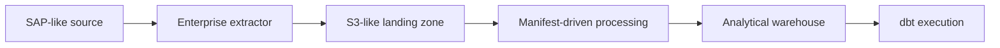

# Reference Architecture

The reference architecture describes the desired real-world pattern that the local PoC explains. It is not an implemented production system and does not prescribe a specific vendor configuration.

## Responsibilities

| Component | Responsibility |
| --- | --- |
| SAP-like source | Owns operational records and business keys. The PoC treats this as a generic source, not as a real SAP system. |
| Enterprise extractor | Reads source data and writes batch files plus metadata. In a real pattern this could be a managed or enterprise-grade extraction tool. |
| S3-like landing zone | Stores immutable data files and manifests under predictable prefixes. |
| Manifest-driven batch processing | Validates manifests, checks files, records batch state, and loads accepted batches. |
| Analytical warehouse | Stores loaded analytical tables for downstream modeling and reporting. |
| dbt execution | Runs transformation commands after a successful load. The dbt project itself remains a separate concern. |

## Batch boundary

The batch is the main unit of control. A batch should have a stable identifier, a clear source and table scope, one or more data files, and a manifest that describes what downstream processing should expect.

This repository does not define cloud infrastructure, extractor runtime behavior, warehouse configuration, or dbt model design.
