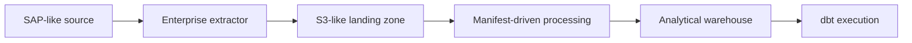

# Reference Architecture

The reference architecture describes the target pattern that the local PoC explains, not an implemented production system.

## Responsibilities

- The SAP-like source owns operational data.
- The enterprise extractor produces consistent data extracts and batch metadata.
- The S3-like landing zone stores immutable batch files and manifests.
- Manifest-driven processing validates and loads accepted batches.
- The analytical warehouse exposes data for modeling and analysis.
- dbt execution applies transformation logic owned by a separate dbt project.

This repository does not define cloud infrastructure, extractor runtime behavior, warehouse configuration, or dbt model design.
