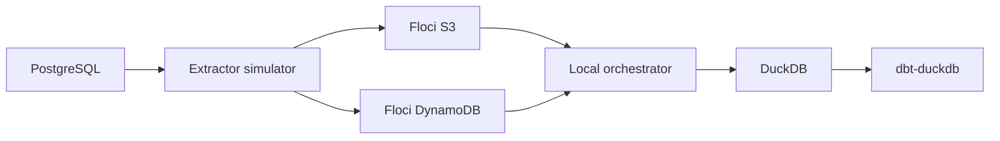

# Local PoC Architecture

The local architecture replaces managed and enterprise components with local equivalents so the flow can be explained safely. The purpose is to demonstrate the pattern, not to reproduce production infrastructure.

## Component mapping

| Reference concern | Local substitute |
| --- | --- |
| SAP-like source | PostgreSQL |
| Enterprise extractor | Extractor simulator |
| S3-like landing zone | Floci S3 |
| Batch state store | Floci DynamoDB |
| Managed orchestration | Local orchestrator |
| Analytical warehouse | DuckDB |
| dbt execution platform | dbt-duckdb |

## Component roles

- PostgreSQL acts as a simple operational source.
- The extractor simulator creates batch files and manifests.
- Floci S3 represents object storage for landed files.
- Floci DynamoDB represents metadata and batch state tracking.
- The local orchestrator validates manifests, controls idempotency, and loads accepted data.
- DuckDB represents the analytical warehouse layer.
- dbt-duckdb represents the downstream transformation execution surface.

The local PoC is designed for architectural validation and demonstration. It is not evidence that production connectivity, scalability, security, or operations are ready.
