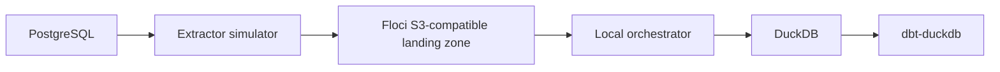

# Local PoC Architecture

The local architecture replaces managed and enterprise components with local equivalents so the flow can be explained safely. The purpose is to demonstrate the selected pattern, not to reproduce production infrastructure.

## Component mapping

| Reference concern | Local substitute |
| --- | --- |
| SAP-like source | PostgreSQL |
| Enterprise extractor | Extractor simulator |
| S3-like landing zone | Floci S3-compatible landing zone |
| Manifest-driven batch processing | Local orchestrator |
| Analytical warehouse | DuckDB |
| dbt execution platform | dbt-duckdb |

## Component roles

- PostgreSQL acts as a simple operational source.
- The extractor simulator creates SAP-like rows, batch files, and enriched manifests.
- Floci provides the local AWS-compatible emulator used for the S3-compatible landing zone.
- The local orchestrator validates manifests, controls idempotency, and loads accepted data.
- DuckDB represents the analytical warehouse layer.
- dbt-duckdb represents the downstream transformation execution surface.

## SAP-like simulator schema

The SAP-like simulator intentionally exposes fields that downstream dbt models commonly expect in enterprise-style extracts. Example fields include:

| Field | Purpose in the simulation |
| --- | --- |
| `mandt` | Client-like partition field. |
| `matnr` | Material-like identifier. |
| `kunnr` | Customer-like identifier. |
| `vbeln` | Sales document-like identifier. |
| `posnr` | Sales item-like identifier. |
| `ersda` | Created-on date commonly found in SAP-like records. |
| `erdat` | Created date. |
| `aedat` | Changed date. |
| `audat` | Document date. |
| `auart` | Sales document type-like code. |
| `vkorg` | Sales organization-like code. |
| `waers` | Currency key-like field. |
| `waerk` | Document currency-like field. |
| `vrkme` | Sales unit-like field. |
| `netwr` | Net value-like measure. |
| `kwmeng` | Order quantity-like measure. |

These names are generic simulator columns. They do not imply real SAP connectivity or compatibility with any specific SAP implementation.

The local PoC is designed for architectural validation and demonstration. It is not evidence that production connectivity, scalability, security, vendor runtimes, or operations are ready.
