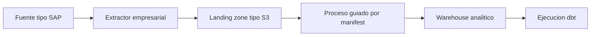

# Arquitectura de Referencia

La arquitectura de referencia describe el patron objetivo que explica la PoC local. No representa un sistema productivo implementado.

## Responsabilidades

- La fuente tipo SAP contiene los datos operacionales.
- El extractor empresarial produce extracciones consistentes y metadatos de lote.
- La landing zone tipo S3 almacena ficheros y manifests inmutables.
- El proceso guiado por manifest valida y carga lotes aceptados.
- El warehouse analitico expone datos para modelado y analisis.
- La ejecucion dbt aplica transformaciones mantenidas en un proyecto dbt separado.

Este repositorio no define infraestructura cloud, runtime del extractor, configuracion de warehouse ni diseno de modelos dbt.
