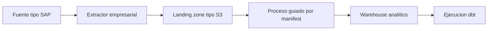

# Arquitectura de Referencia

La arquitectura de referencia describe el patron real deseado que explica la PoC local. No representa un sistema productivo implementado ni prescribe una configuracion concreta de proveedor.

## Responsabilidades

| Componente | Responsabilidad |
| --- | --- |
| Fuente tipo SAP | Contiene registros operacionales y claves de negocio. La PoC la trata como una fuente generica, no como un sistema SAP real. |
| Extractor empresarial | Lee datos fuente y escribe ficheros de lote con metadatos. En un patron real podria ser una herramienta de extraccion gestionada o empresarial. |
| Landing zone tipo S3 | Almacena ficheros de datos y manifests inmutables bajo prefijos predecibles. |
| Proceso por lote guiado por manifest | Valida manifests, comprueba ficheros, registra estado de lote y carga lotes aceptados. |
| Warehouse analitico | Almacena tablas analiticas cargadas para modelado y reporting. |
| Ejecucion dbt | Ejecuta comandos de transformacion despues de una carga correcta. El proyecto dbt queda como responsabilidad separada. |

## Limite de lote

El lote es la unidad principal de control. Un lote debe tener un identificador estable, un alcance claro de fuente y tabla, uno o varios ficheros de datos y un manifest que describa lo que debe esperar el procesamiento posterior.

Este repositorio no define infraestructura cloud, runtime del extractor, configuracion de warehouse ni diseno de modelos dbt.
