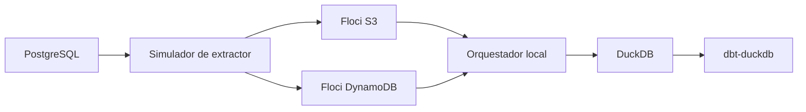

# Arquitectura PoC Local

La arquitectura local sustituye componentes gestionados y empresariales por equivalentes locales para poder explicar el flujo de forma segura. El objetivo es demostrar el patron, no reproducir infraestructura productiva.

## Mapeo de componentes

| Responsabilidad de referencia | Sustituto local |
| --- | --- |
| Fuente tipo SAP | PostgreSQL |
| Extractor empresarial | Simulador de extractor |
| Landing zone tipo S3 | Floci S3 |
| Almacen de estado de lotes | Floci DynamoDB |
| Orquestacion gestionada | Orquestador local |
| Warehouse analitico | DuckDB |
| Plataforma de ejecucion dbt | dbt-duckdb |

## Roles de componentes

- PostgreSQL actua como fuente operacional simple.
- El simulador de extractor crea ficheros de lote y manifests.
- Floci S3 representa almacenamiento de objetos para ficheros aterrizados.
- Floci DynamoDB representa metadatos y seguimiento de estado de lotes.
- El orquestador local valida manifests, controla idempotencia y carga datos aceptados.
- DuckDB representa la capa de warehouse analitico.
- dbt-duckdb representa la superficie de ejecucion de transformaciones posteriores.

La PoC local sirve para validacion arquitectonica y demostracion. No prueba que la conectividad, escalabilidad, seguridad u operacion productiva esten listas.
