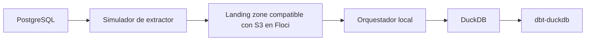

# Arquitectura PoC Local

La arquitectura local sustituye componentes gestionados y empresariales por equivalentes locales para poder explicar el flujo de forma segura. El objetivo es demostrar el patron seleccionado, no reproducir infraestructura productiva.

## Mapeo de componentes

| Responsabilidad de referencia | Sustituto local |
| --- | --- |
| Fuente tipo SAP | PostgreSQL |
| Extractor empresarial | Simulador de extractor |
| Landing zone tipo S3 | Landing zone compatible con S3 en Floci |
| Proceso por lote guiado por manifest | Orquestador local |
| Warehouse analitico | DuckDB |
| Plataforma de ejecucion dbt | dbt-duckdb |

## Roles de componentes

- PostgreSQL actua como fuente operacional simple.
- El simulador de extractor crea filas tipo SAP, ficheros de lote y manifests enriquecidos.
- Floci proporciona el emulador local compatible con AWS usado para la landing zone compatible con S3.
- El orquestador local valida manifests, controla idempotencia y carga datos aceptados.
- DuckDB representa la capa de warehouse analitico.
- dbt-duckdb representa la superficie de ejecucion de transformaciones posteriores.

## Esquema del simulador tipo SAP

El simulador tipo SAP expone intencionadamente campos que los modelos dbt posteriores suelen esperar en extracciones de estilo empresarial. Algunos campos de ejemplo son:

| Campo | Proposito en la simulacion |
| --- | --- |
| `mandt` | Campo de particion similar a cliente. |
| `matnr` | Identificador similar a material. |
| `kunnr` | Identificador similar a cliente comercial. |
| `vbeln` | Identificador similar a documento de ventas. |
| `posnr` | Identificador similar a posicion de documento. |
| `ersda` | Fecha de creacion habitual en registros tipo SAP. |
| `erdat` | Fecha de creacion. |
| `aedat` | Fecha de modificacion. |
| `audat` | Fecha de documento. |
| `auart` | Codigo similar a tipo de documento de ventas. |
| `vkorg` | Codigo similar a organizacion de ventas. |
| `waers` | Campo similar a clave de moneda. |
| `waerk` | Campo similar a moneda del documento. |
| `vrkme` | Campo similar a unidad de venta. |
| `netwr` | Medida similar a valor neto. |
| `kwmeng` | Medida similar a cantidad de pedido. |

Estos nombres son columnas genericas del simulador. No implican conectividad SAP real ni compatibilidad con ninguna implementacion SAP especifica.

La PoC local sirve para validacion arquitectonica y demostracion. No prueba que la conectividad, escalabilidad, seguridad, runtimes de proveedor u operacion productiva esten listas.
